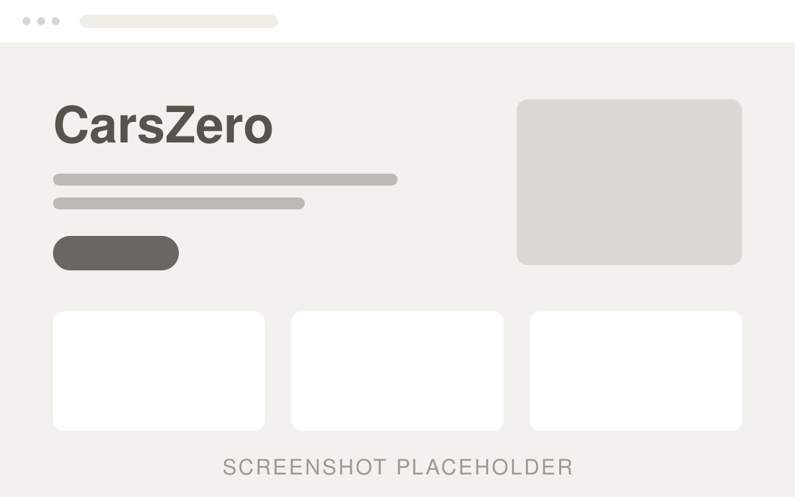

# Portfolio — one-page site

Static site. No build step, no dependencies. Open `index.html` in a browser, or serve it:

    python -m http.server 8000

## Files

    index.html      all content
    styles.css      all styling
    script.js       scroll reveal + header hairline
    favicon.svg     favicon placeholder (monogram)
    assets/         project screenshot placeholders

## What to replace

Every spot to edit is marked with a `<!-- REPLACE: ... -->` comment in `index.html`.

Already filled in: name **Volodya**, email **firegame2006@gmail.com**, Telegram **@WowCh_ok**.
No phone number is used anywhere on the site.

1. **Project links** — each card has `Live Demo` and `GitHub` buttons plus the image link
   (3 places per card); swap `href="#"` for the real URL.
   Keep `target="_blank" rel="noopener noreferrer"`.
2. **GitHub** — replace `github.com/username` in the Contact section.
3. **Third project** — project 03 is commented out at the end of the projects grid.
   Delete the comment markers around it when a third site is ready
   (the desktop grid is 2 columns; change `repeat(2, 1fr)` to `repeat(3, 1fr)`
   in `styles.css` if you want three across).
4. **Screenshots** — drop your image into `assets/` and change the `src`:

          ->   

   Use a 16:10 image (e.g. 1600x1000). Keep `loading="lazy"` and `width`/`height`
   so the layout never jumps. Export as WebP for the smallest file size.
5. **Tags** — each `<li>` inside `.tags` is one tag.
6. **SEO** — `<title>`, the meta description, and the Open Graph tags at the top of `index.html`.
